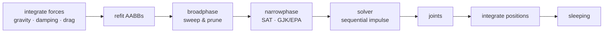

# omi_physics

A renderer-agnostic, real-time **rigid-body physics engine** for Python, built
natively on the [OMI glTF physics](https://github.com/omigroup/gltf-extensions)
data model. State lives in flat NumPy arrays, the whole step pipeline is
vectorized, and optional compiled Cython accelerators drop in transparently for
the hot paths (the contact solver and box/sphere collision).

- **NumPy is the only hard dependency.** No graphics library is required to
  simulate.
- **PyOpenGL is optional** — used solely by the experimental GPU compute backend
  (`omi_physics.glcompute`).
- **Deterministic** on the CPU backend: the same inputs produce the same
  trajectory, run to run.
- **Fast**: sweep-and-prune broadphase, SAT/GJK narrowphase, an island-parallel
  sequential-impulse solver, sleeping, and a background-threaded simulation loop
  that overlaps with a consumer's render/IO thread.

> ⚠️ **This code is largely LLM-written.** It has a test suite and the CPU
> backend is deterministic, but it comes with **no guarantees** of correctness,
> accuracy, or fitness for any purpose (see [`LICENSE`](LICENSE), MIT). Review it
> before relying on it for anything that matters.

## Install

```bash
pip install omi_physics            # core engine (NumPy only)
pip install "omi_physics[gl]"      # + PyOpenGL for the GPU compute backend
```

Prebuilt wheels ship the compiled accelerators, so no C compiler is needed. A
source install without a compiler still works — the engine falls back to the
identical pure-NumPy code paths.

## Quick start

```python
import numpy as np
from omi_physics import PhysicsWorld, model

world = PhysicsWorld(gravity=model.Gravity(gravity=9.81, direction=(0, -1, 0)))

# A static ground box and a dynamic box that falls onto it.
ground = world.add_shape(model.Shape.box((20, 1, 20)))
box    = world.add_shape(model.Shape.box((1, 1, 1)))
wood   = world.add_material(model.Material())

world.add_body(model.Motion(type=model.STATIC),
               collider=model.Collider(shape=ground, physicsMaterial=wood),
               position=(0, 0, 0))
falling = world.add_body(model.Motion(type=model.DYNAMIC, mass=1.0),
                         collider=model.Collider(shape=box, physicsMaterial=wood),
                         position=(0, 5, 0))

for _ in range(120):                       # 2 seconds at 60 Hz
    world.step(1 / 60)

print(world.position[falling])             # resting on the ground
```

> The exact `add_body`/`add_shape` signatures are the source of truth in
> [`world.py`](src/omi_physics/world.py); see the tests for worked examples.

### Off-thread simulation

`ThreadedSimulation` steps the world on a daemon thread and publishes an
immutable pose snapshot each tick. A renderer reads the latest snapshot every
frame without ever blocking on the solver:

```python
from omi_physics.threaded import ThreadedSimulation

sim = ThreadedSimulation(world, sim_hz=120)
sim.start()
# ... each render frame:
snapshot, version = sim.latest()           # (position, axis_angle, awake, dynamic)
# ... on shutdown:
sim.stop()
```

## How it works

One `world.step(dt)` runs this fixed-timestep pipeline over the world's
structure-of-arrays state:



The data model is OMI glTF physics (`model.Shape`, `Motion`, `Collider`,
`Material`, `Joint`, ...), so scenes round-trip to and from glTF documents
(`omi_physics.omi_gltf`). See [`docs/`](docs/) for a deep dive:

- [`docs/ARCHITECTURE.md`](docs/ARCHITECTURE.md) — components, layering, and how
  they fit together.
- [`docs/PIPELINE.md`](docs/PIPELINE.md) — the step pipeline stage by stage, with
  the data that flows between stages.
- [`docs/DATA-MODEL.md`](docs/DATA-MODEL.md) — the OMI data model and the
  structure-of-arrays world state.
- [`docs/ACCELERATORS.md`](docs/ACCELERATORS.md) — the Cython accelerators and the
  pure-Python fallback contract.

## Working on omi_physics

```bash
git clone https://github.com/mcfletch/omi_physics
cd omi_physics
python -m venv .venv && source .venv/bin/activate
pip install -e ".[dev]"          # editable install, builds the accelerators
pytest                            # run the test suite
```

Handy commands:

```bash
# Rebuild the accelerators in place after editing a .pyx
python setup.py build_ext --inplace

# Force the pure-Python fallback (delete the compiled modules)
rm -f src/omi_physics/*.so

# Type-check and lint
mypy src/omi_physics
ruff check src tests
```

The accelerators are a **pure speedup**: every `.pyx` has an identical NumPy/
Python implementation the engine uses when the compiled module is absent. Tests
must pass in both configurations (with and without the `.so` files present).

## Layout

```
src/omi_physics/        the engine (importable as omi_physics)
  model.py              OMI glTF physics data model
  world.py              PhysicsWorld — structure-of-arrays state + step()
  backend.py            NumpyBackend / GPU backend selection
  glcompute.py          optional GL 4.3 compute integration backend (needs PyOpenGL)
  broadphase.py         sweep-and-prune + dynamic AABB tree
  collide.py            SAT box-box, sphere tests (vectorized)
  gjk.py                GJK/EPA for convex shapes
  narrowphase.py        contact generation, routes to accelerators
  solver.py             island-parallel sequential-impulse contact solver
  joints.py             point / distance / hinge constraints and motors
  character.py          kinematic character controller
  cookery.py / hull.py  shape cooking (convex hulls, trimeshes)
  omi_gltf.py           read/write OMI physics from glTF documents
  threaded.py           ThreadedSimulation — background-thread stepping
  _solver_native.pyx    Cython contact solver accelerator
  _collide_native.pyx   Cython collision accelerator
tests/                  pytest suite (pure NumPy; GPU-parity tests skip w/o GL)
docs/                   deep-dive documentation (Markdown + Mermaid)
```

## License

MIT — see [`LICENSE`](LICENSE). In some jurisdictions LLM generated
code cannot have any copyright assignment. The intent of the license
is that anyone anywhere can use the code for whatever purpose they
deem fit, provided that they assume any liability for that usage.
