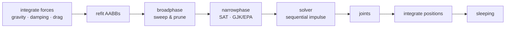

# omi_physics

A renderer-agnostic, real-time **rigid-body physics engine** for Python, built
natively on the [OMI glTF physics](https://github.com/omigroup/gltf-extensions)
data model. State lives in flat NumPy arrays, the whole step pipeline is
vectorized, and optional compiled Cython accelerators drop in transparently for
the hot paths (the contact solver and box/sphere collision).

- **NumPy is the only hard dependency.** No graphics library is required to
  simulate.
- **PyOpenGL is optional** — used solely by the experimental GPU compute backend
  (`omi_physics.glcompute`).
- **Deterministic** on the CPU backend: the same inputs produce the same
  trajectory, run to run.
- **Fast**: sweep-and-prune broadphase, SAT/GJK narrowphase, an island-parallel
  sequential-impulse solver, sleeping, and a background-threaded simulation loop
  that overlaps with a consumer's render/IO thread.

> ⚠️ **This code is largely LLM-written.** It has a test suite and the CPU
> backend is deterministic, but it comes with **no guarantees** of correctness,
> accuracy, or fitness for any purpose (see [`LICENSE`](LICENSE), MIT). Review it
> before relying on it for anything that matters.

## Install

```bash
pip install omi_physics            # core engine (NumPy only)
pip install "omi_physics[gl]"      # + PyOpenGL for the GPU compute backend
```

Prebuilt wheels ship the compiled accelerators, so no C compiler is needed. A
source install without a compiler still works — the engine falls back to the
identical pure-NumPy code paths.

## Quick start

```python
import numpy as np
from omi_physics import PhysicsWorld, model

world = PhysicsWorld(gravity=model.Gravity(gravity=9.81, direction=(0, -1, 0)))

# A static ground box and a dynamic box that falls onto it.
ground = world.add_shape(model.Shape.box((20, 1, 20)))
box    = world.add_shape(model.Shape.box((1, 1, 1)))
wood   = world.add_material(model.Material())

world.add_body(model.Motion(type=model.STATIC),
               collider=model.Collider(shape=ground, physicsMaterial=wood),
               position=(0, 0, 0))
falling = world.add_body(model.Motion(type=model.DYNAMIC, mass=1.0),
                         collider=model.Collider(shape=box, physicsMaterial=wood),
                         position=(0, 5, 0))

for _ in range(120):                       # 2 seconds at 60 Hz
    world.step(1 / 60)

print(world.position[falling])             # resting on the ground
```

> The exact `add_body`/`add_shape` signatures are the source of truth in
> [`world.py`](src/omi_physics/world.py); see the tests for worked examples.

### Off-thread simulation

`ThreadedSimulation` steps the world on a daemon thread and publishes an
immutable pose snapshot each tick. A renderer reads the latest snapshot every
frame without ever blocking on the solver:

```python
from omi_physics.threaded import ThreadedSimulation

sim = ThreadedSimulation(world, sim_hz=120)
sim.start()
# ... each render frame:
snapshot, version = sim.latest()           # (position, axis_angle, awake, dynamic)
# ... on shutdown:
sim.stop()
```

## How it works

One `world.step(dt)` runs this fixed-timestep pipeline over the world's
structure-of-arrays state:



The data model is OMI glTF physics (`model.Shape`, `Motion`, `Collider`,
`Material`, `Joint`, ...), so scenes round-trip to and from glTF documents
(`omi_physics.omi_gltf`).

### How hard something was hit

`world.impact_on(body)` answers what struck a body in the step just run and how
fast the two were closing along the contact when they met, in metres per second
— the number damage, a crash, an impact sound or a jolt of force feedback is
decided from.

```python
for _ in range(steps):
    world.step(1 / 120)
    struck = world.impact_on(player, above=1.0, skip_static=True)
    if struck is not None:
        other, closing = struck
        crunch(closing)
```

**Ask once a step, not once a frame.** A frame is several steps, contacts are
rebuilt in each of them, and the speed on a contact is taken *before* the solve
— because resolving a contact is precisely cancelling the velocity that measures
it. Sampled a step late, a square-on impact reads as nothing while a glancing
one reads almost undiminished, which is the wrong way round for anything that
has to tell a crash from a scrape.

`above` is the speed below which a contact is not a blow. A body held against
something is closing on it slightly on every step: over one step gravity gives
it `g·dt` for the solver to take away again, so a box resting on the floor at
120 Hz reads about 0.08 m/s for as long as it sits there. `skip_static` leaves
out what a body landed on, for a caller that wants to know what it *hit*.

A body the game moves itself has to be told its velocity as well as its pose
(`place_body`, then a write to `linear_velocity`). Without one it is a wall:
the solver resolves against the difference between two bodies' velocities, so a
moving platform written down as still throws off whatever lands on it and reads
as having been hit at the full speed of anything that merely caught it up.

### Driving a car

`RaycastVehicle` is the model every driving game uses: a rigid body with no
wheels in it, each wheel a ray cast down from where its suspension is mounted,
a spring pushing the body up off whatever the ray finds, and a patch of friction
at that point driving, braking and steering. `WheelSpec` says where a wheel is
and what it is for; `VehicleTuning` says what the pedals and the wheel are worth.

The four wheels are cast **together**. They all look at very nearly the same
piece of the world, so `raycast_many` decides which bodies are worth testing
once and asks a landscape's mesh once for the triangles near all four rather
than once per wheel; on a streamed world that is most of a physics step.

**Every wheel is worked out against the same body.** Four wheels push on one
chassis in the same step, and they touch the ground at the same instant. Working
each one out against a body the wheel before it has already moved makes the four
asymmetric, and the car wanders to whichever side is worked out first — a road's
width in a few seconds of straight-line acceleration, and to the other side if
the wheels are listed in another order. So a step reads one stance of the body,
asks every wheel about that, and applies what they all asked for together.

**The air is carried by the wheels holding the car up.** Drag is a force on the
body, handed to the contacts so that a tyre with nothing to push against cannot
hold the car back with it — and shared out by how much of the car each wheel is
carrying, not in equal parts. A wheel the weight has come off under acceleration
has almost no friction to spend, and an equal share of the drag spends all of
it; what it gives up to find that is the sideways hold, since driving and
gripping come out of one budget.

**The steering lock falls with the square of the speed.** A lock is chosen for a
car park — full lock at walking pace is a three-point turn — and the same lock at
forty metres a second asks for ten g and ends with the car pointing at the trees.
Halving it for every doubling of speed is not enough, because cornering is
`v**2 / radius` and a radius that only widens in step with the speed is a demand
that still doubles with it. Against `steer_falloff_speed` squared, what full lock
asks of the tyres settles at a corner they can hold instead of running away with
the speedometer, and the same touch of a key means a gentler turn the faster the
car goes (`VehicleTuning.steer_lock`).

**A tyre does not build its side force instantly.** The tread has to be laid
down and deflected, which takes a fraction of a wheel's turn — the relaxation
length, about a third of a metre on a road tyre — so a step takes out most of
the sideways scrub and not all of it (`SCRUB_RELAXATION`). The numerics want the
same thing: four wheels correcting one body in one step, each taking all of what
it can see, take more yaw and more roll out of the car than there was and put
some back the other way. What that looks like is a car shaking its head at the
rate of the physics loop, worst on a crowned road — which is every road, since
they are all built to drain.

**A car left alone stays where it is.** With nothing asked of it and barely
moving, `VehicleTuning.holding` newtons hold it: a parked car is in gear or on
its handbrake, and one that coasts off down a slope makes stopping anywhere but
the flat a mistake. Divided by the car's weight, that number is the steepest
grade it holds on; zero is a vehicle out of gear.

Each wheel also looks a little **above** itself, `VehicleTuning.ground_recovery`
metres of it. A wheel that only looks down cannot see ground that has come up
under the car — a lift, a moving platform, a landscape paging in at a finer
level of detail than the one the car was driving on — and a car that cannot see
the ground has no grip, no drive and nothing holding it up: it coasts, buried,
until something else notices. A wheel that finds the ground up there is pushed
back out on to it at `recovery_speed`, which climbs the car out rather than
firing it into the air.

See [`docs/`](docs/) for a deep dive:

- [`docs/ARCHITECTURE.md`](docs/ARCHITECTURE.md) — components, layering, and how
  they fit together.
- [`docs/PIPELINE.md`](docs/PIPELINE.md) — the step pipeline stage by stage, with
  the data that flows between stages.
- [`docs/DATA-MODEL.md`](docs/DATA-MODEL.md) — the OMI data model and the
  structure-of-arrays world state.
- [`docs/ACCELERATORS.md`](docs/ACCELERATORS.md) — the Cython accelerators and the
  pure-Python fallback contract.

## Working on omi_physics

```bash
git clone https://github.com/mcfletch/omi_physics
cd omi_physics
python -m venv .venv && source .venv/bin/activate
pip install -e ".[dev]"          # editable install, builds the accelerators
pytest                            # run the test suite
```

Handy commands:

```bash
# Rebuild the accelerators in place after editing a .pyx
python setup.py build_ext --inplace

# Force the pure-Python fallback (delete the compiled modules)
rm -f src/omi_physics/*.so

# Lint and type-check. Both read pyproject.toml for everything -- which files,
# which rules, which Python -- so there are no flags to remember and a local
# run is the same run CI makes.
ruff check
mypy

# The whole matrix -- lint, types, and both accelerator paths on every
# interpreter present
tox
```

`tox -e lint` and `tox -e typecheck` are the same two commands, and CI runs them
on the 3.12 row, so a merge is gated on them. `ruff format` is configured but is
not one of the gates: the array expressions here are laid out so the arithmetic
keeps its shape -- a cross product is three rows because it is three rows -- and
the formatter sets them as filled paragraphs of code. Line width is held by
`ruff check` instead.

The suite has two halves. Most of it checks the engine against scenes written
down by hand: a ball dropped three metres, a stack of five boxes, a wheel on a
slope. The `tests/test_properties_*.py` files check the same code against inputs
nobody wrote down — a collider with no radius, a "triangle" whose three vertices
are one point, a dozen bodies already inside one another, a hundred-kilogramme
crate resting on a hundred-gramme one — and assert only what has to hold of
every answer: that the world stays made of numbers, that a contact normal is a
direction, that separating by the depth a contact reports separates it. They are
written with [hypothesis](https://hypothesis.readthedocs.io/), which generates
the cases, shrinks a failure to the smallest one that still fails, and remembers
it — so a defect found once is a regression test from then on.

Hypothesis is a **CPython-only** test dependency: it publishes no wheel for the
PyPy in the matrix. The property files skip where it is absent, and everything
else runs there as before.

The accelerators are a **pure speedup**: every `.pyx` has an identical NumPy/
Python implementation the engine uses when the compiled module is absent. Tests
must pass in both configurations (with and without the `.so` files present).

## Layout

```
src/omi_physics/        the engine (importable as omi_physics)
  model.py              OMI glTF physics data model
  world.py              PhysicsWorld — structure-of-arrays state + step()
  backend.py            NumpyBackend / GPU backend selection
  glcompute.py          optional GL 4.3 compute integration backend (needs PyOpenGL)
  broadphase.py         sweep-and-prune + dynamic AABB tree
  collide.py            SAT box-box, sphere tests (vectorized)
  gjk.py                GJK/EPA for convex shapes
  narrowphase.py        contact generation, routes to accelerators
  solver.py             island-parallel sequential-impulse contact solver
  joints.py             point / distance / hinge constraints and motors
  character.py          kinematic character controller
  vehicle.py            raycast vehicle: suspension, drive, steering
  cookery.py / hull.py  shape cooking (convex hulls, trimeshes)
  omi_gltf.py           read/write OMI physics from glTF documents
  threaded.py           ThreadedSimulation — background-thread stepping
  _solver_native.pyx    Cython contact solver accelerator
  _collide_native.pyx   Cython collision accelerator
tests/                  pytest suite (pure NumPy; GPU-parity tests skip w/o GL)
  test_properties_*.py  property tests over generated input (hypothesis)
docs/                   deep-dive documentation (Markdown + Mermaid)
```

## License

MIT — see [`LICENSE`](LICENSE). In some jurisdictions LLM generated
code cannot have any copyright assignment. The intent of the license
is that anyone anywhere can use the code for whatever purpose they
deem fit, provided that they assume any liability for that usage.
