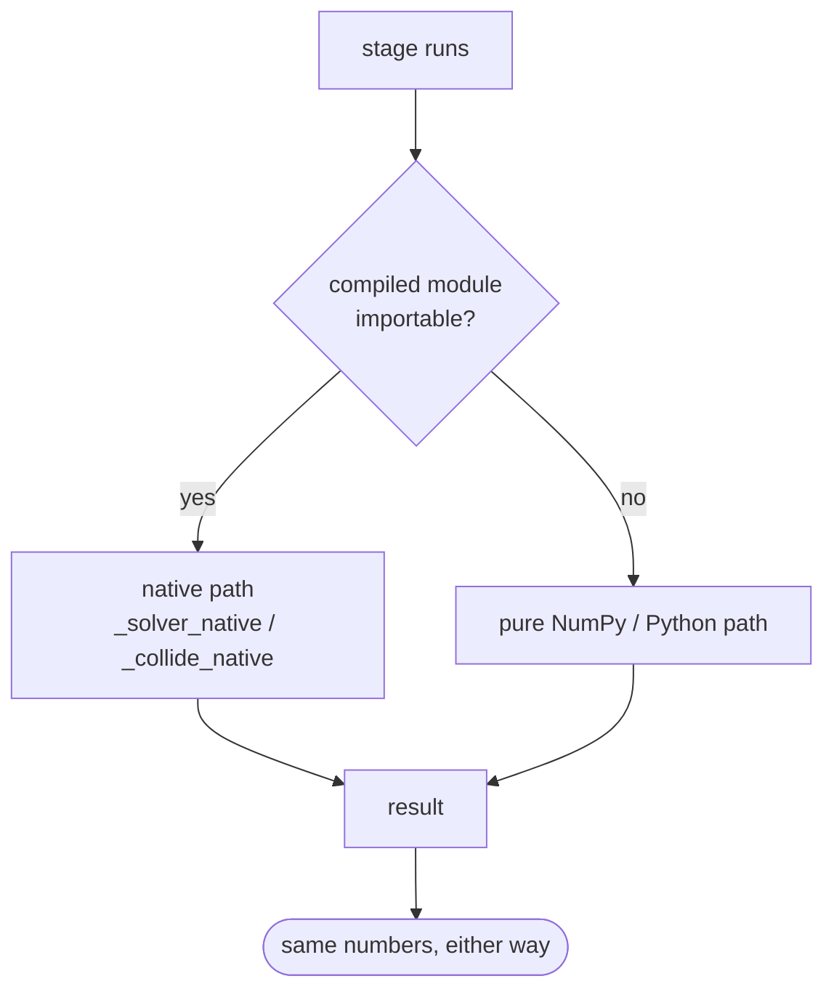
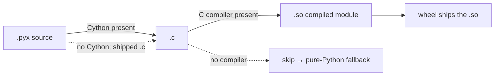

# Accelerators

The two hot stages — the contact **solver** and box/sphere **collision** — have
optional Cython implementations that compile to native code. They are a **pure
speedup**: when the compiled module is present the engine uses it; when it is
absent the engine runs an identical NumPy/Python implementation and produces the
same results. Nothing else in the code changes.

| Accelerator | Replaces | Used by |
| --- | --- | --- |
| `_solver_native.pyx` | sequential-impulse inner loops (constraint prep, warm start, velocity + position iterations) | `solver.py` |
| `_collide_native.pyx` | SAT box-box (with Sutherland–Hodgman clipping), sphere-sphere, sphere-box; **capsule against a batch of triangles** | `narrowphase.py`, `collide.py` |

## The fallback contract

Each consumer imports its accelerator inside a `try` / `except ImportError`, sets
the module to `None` on failure, and guards every call site:

```python
# solver.py
try:
    from . import _solver_native as _native   # compiled Cython inner loops
except ImportError:
    _native = None
...
if _native is not None and hasattr(_native, 'prepare_and_solve'):
    self._solve_native_full(world, contacts)   # native path
else:
    ...                                        # identical NumPy/Python path
```



The `hasattr` check is deliberate: it means a partially-built or older accelerator
missing a given entry point still degrades to the Python path for that call rather
than crashing.

## Why these two, and how they stay honest

Integration and broadphase are already whole-array NumPy operations — they are as
fast as they are going to get without leaving Python, and there is little to gain
from native code. The solver and narrow phase are different: they are inherently
**per-contact, sequential** work (Gauss–Seidel resolves each contact reading the
velocities the previous contact just wrote), which NumPy cannot vectorize away. So
those are the loops worth compiling.

Because both paths must agree, the accelerators are **differential-tested**: the
test suite exercises the same scenes with and without the compiled modules and
asserts the trajectories match. When you change a `.pyx`, keep its Python twin in
lockstep and run the suite both ways:

```bash
pytest                            # with the compiled .so present
rm -f src/omi_physics/*.so
pytest                            # pure-Python fallback
python setup.py build_ext --inplace   # rebuild
```

## Building

The accelerators build from source via `setup.py`, which cythonizes the `.pyx`
files (falling back to shipped `.c` if Cython is unavailable) and **never fails
the install** — a missing compiler just leaves the pure-Python path in place:



Prebuilt wheels (built in CI with `cibuildwheel`) carry the compiled `.so` for
each supported Python and platform, plus the `.pyx` sources so a source install
can still rebuild. End users therefore get native speed with no compiler; source
installs without a toolchain still work, only slower.
