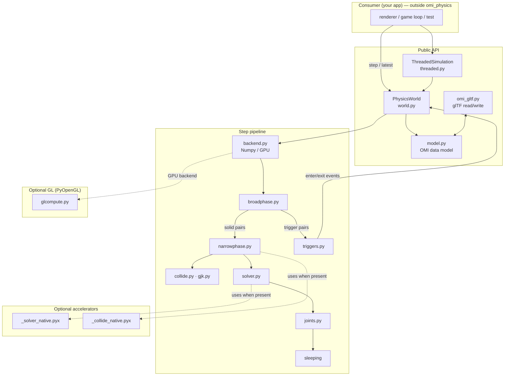

# Architecture

`omi_physics` is a rigid-body engine whose state lives in flat NumPy arrays and
whose simulation runs as a fixed-timestep pipeline of vectorized stages. Nothing
in the core touches a graphics library; a renderer (or a network layer, or a
head-less test) sits *outside* and reads poses back each frame.

## Layers

The arrows into the accelerators are dashed because they are **optional**: when
the compiled modules are absent, the same stages run their pure-NumPy code. GL is
similarly optional — only `glcompute.py` imports PyOpenGL, and only when a caller
explicitly selects the GPU backend.

## Modules

| Module | Responsibility |
| --- | --- |
| `model.py` | The OMI glTF physics data model: `Shape`, `Motion`, `Collider`, `Trigger`, `Material`, `CollisionFilter`, `Gravity`, `Joint`. Immutable dataclasses. |
| `world.py` | `PhysicsWorld` — the structure-of-arrays state and the `step(dt)` that advances it. Source of truth for the simulation. |
| `mathutil.py` | Quaternion / matrix helpers, batched (`quat_integrate`, `quat_to_axis_angle`, `quat_to_matrix`, `cross3`). |
| `backend.py` | The compute-backend surface. `NumpyBackend` is the CPU path; `select_backend()` picks CPU vs GPU. |
| `glcompute.py` | `GLComputeBackend` — per-body integration as GL 4.3 compute shaders. Requires PyOpenGL; falls back to NumPy. |
| `broadphase.py` | Sweep-and-prune plus a dynamic AABB tree; produces candidate overlapping pairs. |
| `collide.py` | Vectorized SAT box-box and sphere tests producing contact manifolds. |
| `gjk.py` | GJK/EPA for general convex shapes. |
| `narrowphase.py` | Turns broadphase pairs into contacts; routes box/sphere pairs to `_collide_native` when present. |
| `solver.py` | Island-parallel sequential-impulse contact solver with warm starting; routes to `_solver_native` when present. |
| `joints.py` | Point, distance, and hinge constraints and angular motors. |
| `triggers.py` | Non-solid trigger volumes and enter/exit events. |
| `character.py` | A kinematic character controller (walking, stepping, slopes). |
| `cookery.py`, `hull.py` | Shape "cooking": convex hull / trimesh preparation. |
| `omi_gltf.py` | Read OMI physics bodies out of a glTF document and write them back. |
| `threaded.py` | `ThreadedSimulation` — runs `step()` on a daemon thread, publishes snapshots. |

## Design principles

- **Structure-of-arrays, not array-of-structs.** Every per-body quantity is one
  contiguous NumPy column, so each stage is a whole-array operation over the
  awake bodies rather than a Python loop. This is what makes the CPU path fast
  and what makes a future full-GPU residency plausible.
- **Renderer-agnostic core.** The world never imports a scene graph or a GL
  binding. Consumers read `world.position` / `world.orientation` (or a
  `ThreadedSimulation` snapshot) and draw however they like.
- **Accelerators are a pure speedup.** Each `.pyx` mirrors a NumPy/Python
  implementation exactly; the engine imports the compiled module when present and
  is otherwise unchanged. See [ACCELERATORS.md](ACCELERATORS.md).
- **Deterministic on CPU.** The NumPy backend is float64 and order-stable, so a
  scene replays identically. The GPU backend is float32 and matches only within
  tolerance — a deliberate trade for scale.
