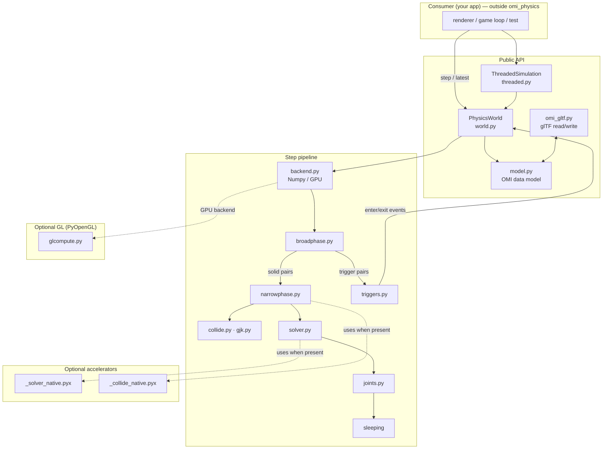

# Architecture

`omi_physics` is a rigid-body engine whose state lives in flat NumPy arrays and
whose simulation runs as a fixed-timestep pipeline of vectorized stages. Nothing
in the core touches a graphics library; a renderer (or a network layer, or a
head-less test) sits *outside* and reads poses back each frame.

## Layers

The arrows into the accelerators are dashed because they are **optional**: when
the compiled modules are absent, the same stages run their pure-NumPy code. GL is
similarly optional — only `glcompute.py` imports PyOpenGL, and only when a caller
explicitly selects the GPU backend.

## Modules

| Module | Responsibility |
| --- | --- |
| `model.py` | The OMI glTF physics data model: `Shape`, `Motion`, `Collider`, `Trigger`, `Material`, `CollisionFilter`, `Gravity`, `Joint`. Immutable dataclasses. |
| `world.py` | `PhysicsWorld` — the structure-of-arrays state and the `step(dt)` that advances it. Source of truth for the simulation. |
| `mathutil.py` | Quaternion / matrix helpers, batched (`quat_integrate`, `quat_to_axis_angle`, `quat_to_matrix`, `cross3`). |
| `backend.py` | The compute-backend surface. `NumpyBackend` is the CPU path; `select_backend()` picks CPU vs GPU. |
| `glcompute.py` | `GLComputeBackend` — per-body integration as GL 4.3 compute shaders. Requires PyOpenGL; falls back to NumPy. |
| `broadphase.py` | Sweep-and-prune plus a dynamic AABB tree; produces candidate overlapping pairs. |
| `collide.py` | Vectorized SAT box-box and sphere tests producing contact manifolds. **Capsule↔triangle is answered for a whole batch at once** (`capsule_triangles`, `capsule_triangle_batch`), because it is the character controller's inner loop and the per-triangle form is dominated by *dispatch*, not arithmetic: the scalar routine spends about seventy microseconds a triangle, nearly all of it entering and leaving numpy over three-element vectors. A controller runs three depenetration iterations inside each of four calls a frame, so that overhead is the whole frame at a handful of characters and hopeless at a hundred. The batch is the compiled accelerator when it is present and a numpy pass otherwise, and the two are asserted to agree triangle for triangle against the scalar routine as well as against geometry worked out by hand. `capsule_mesh_pushes` goes one step further for the controller and answers **two arrays rather than a list of `Contact`s** — the push direction and the depth, deepest first — because those two fields are all a depenetration resolve reads, and building twenty thousand short-lived objects a frame to read two fields from each is the next cost down once the triangle loop is gone. |
| `gjk.py` | GJK/EPA for general convex shapes. |
| `narrowphase.py` | Turns broadphase pairs into contacts; routes box/sphere pairs to `_collide_native` when present. |
| `solver.py` | Island-parallel sequential-impulse contact solver with warm starting; routes to `_solver_native` when present. |
| `joints.py` | Point, distance, and hinge constraints and angular motors. |
| `triggers.py` | Non-solid trigger volumes and enter/exit events. |
| `raycast.py` | **What does this line meet?** — the query a hitscan weapon and a line-of-sight check both want, so it is here rather than written twice in a game. Returns the *nearest* hit with its point and a normal **always facing back along the ray**, so an impact effect is oriented the same way whichever side of a surface was struck and whichever way a map's triangles happened to be wound; a cast that returned any hit rather than the nearest shoots through walls, and the whole shape of it — cheap AABB reject, exact test, keep the closest, shrink the reach as the answer improves — exists for that. Sphere, box, capsule and trimesh are solved exactly; a **convex hull is named rather than guessed at** (`unsupported_shapes`), because doing it properly wants the hull's faces and a body this holds only the points of would otherwise be a wrong hit point blamed on the caller. A trimesh's world-space triangles are cached against the pose they were built for, so a level — one static mesh of tens of thousands of triangles — is transformed once rather than per cast, and the cast is narrowed to the cells the ray crosses through that mesh's `TriangleGrid` rather than by testing every triangle's bound. A hit on a trimesh also names **which triangle** it met (`RayHit.triangle`, an index into that shape's own `indices`, and `NO_TRIANGLE` for a shape that has no parts), because a level is one mesh of many materials and that index is the only thing that tells stone from metal at an impact point — the alternative being a second search of the geometry for a point the cast had already found. |
| `trigrid.py` | **Which triangles are near this query?** — a uniform grid over a triangle soup, shared by the two things that interrogate a level's collision mesh many times a frame: the character controller (`body.py`, by box) and `raycast.py` (by ray). Answering either by looking at every triangle is O(T) per query, which at a real map's 66k triangles is milliseconds a cast — enough that a few bots do not fit in a frame. Asking **along a ray** rather than by the ray's bounding box is the point of the second query: a cast from one end of a level to the other has a box containing the whole level, so only walking the cells the ray actually enters makes a long cast cheap. A query is never allowed to lose a triangle it touches — the grid narrows and the caller still does the exact test — so its contract is a *superset*, and the only other thing that matters is that the superset is small. Triangles spanning very many cells are not binned at all but kept on a list every query looks at, because one triangle can span a level. The two queries differ in how they finish: a **ray** filters its candidates by the query's own bounds, which is semantics rather than speed — it is what stops a cast answering with triangles past its own limit — while a **box** hands its cells back unfiltered, because a box's contract is a superset the caller must test exactly anyway, and that exact test now costs a fraction of a microsecond a triangle where the filter costs two gathers and four reductions however few candidates there are. Paying the expensive thing to save the cheap one is the wrong way round, and the character-sized box is the query asked most often. |
| `character.py` | A kinematic character controller (walking, stepping, slopes). Speed is spent *along* the ground, so a ramp does not slow the player; `maxSlope` decides what counts as ground for standing, seating and stepping alike; `coyoteTime`/`jumpBuffer` keep a jump from being swallowed by a frame where `grounded` happened to be false; a rising capsule is never grounded, so a launch is not snapped back onto the floor by the ground probe on a machine fast enough that one frame's rise is shorter than the probe; and a step-up owes back whatever it advanced beyond its frame's due, so stairs are climbed at running pace rather than at frame-rate pace. **A frame is stepped in pieces short enough that collision cannot be outrun**: contact is discrete, so a step that carries the capsule clean past a surface leaves nothing overlapping to be stopped by, and a fall from a few storeys does exactly that at any ordinary frame rate. The two axes get different allowances because the capsule is taller than it is wide, and `terminalVelocity` sets both how fast a fall may get and -- from that -- the most substeps a frame can ever need, so the two cannot disagree the way a hand-picked ceiling eventually does. **Three body states, not two**: walking, flying (noclip -- no gravity, no collision) and *swimming*, which is neither. A swimmer moves as a flier does, in three dimensions at one speed with no ground to walk along, and **collides as a walker does**, so a pool has a bottom, a wall and a ceiling -- a swim built on noclip is a player who can leave a pool through its side. The vertical is its own thing: gravity scaled by whatever `buoyancy` does not cancel (1.0 hangs, 0.0 sinks at full weight, above 1.0 rises), bled away by `swimDrag`, so a sink settles at a steady speed rather than accelerating to terminal velocity -- and that difference in *speed* is most of what tells a player they are in water rather than in a hole in the floor. Speed builds and coasts rather than switching on and off, because water is something you push against. Vertical speed is dropped entering and leaving, so a fall does not carry through the surface and a rising swimmer is not launched into the air on breaking it. **The triangles near the capsule are gathered once and reused across the frame** (`_near_triangles`, `NEAR_MARGIN`): the ground probe, the move, the step-up and the step-down each resolve three times, at positions centimetres apart, and the broad phase does not change its answer over that — so it is asked once for a box grown by the margin and the gather serves all of them. A superset is safe, because the exact test rejects the rest. That cache is per *avatar*, unlike the static-proxy cache it sits beside, which is per world: a proxy is the same for everyone standing in a level, and where a capsule is, is not. |
| `cookery.py`, `hull.py` | Shape "cooking": convex hull / trimesh preparation. |
| `omi_gltf.py` | Read OMI physics bodies out of a glTF document and write them back. |
| `threaded.py` | `ThreadedSimulation` — runs `step()` on a daemon thread, publishes snapshots. |

## Design principles

- **Structure-of-arrays, not array-of-structs.** Every per-body quantity is one
  contiguous NumPy column, so each stage is a whole-array operation over the
  awake bodies rather than a Python loop. This is what makes the CPU path fast
  and what makes a future full-GPU residency plausible.
- **Renderer-agnostic core.** The world never imports a scene graph or a GL
  binding. Consumers read `world.position` / `world.orientation` (or a
  `ThreadedSimulation` snapshot) and draw however they like.
- **Accelerators are a pure speedup.** Each `.pyx` mirrors a NumPy/Python
  implementation exactly; the engine imports the compiled module when present and
  is otherwise unchanged. See [ACCELERATORS.md](ACCELERATORS.md).
- **Deterministic on CPU.** The NumPy backend is float64 and order-stable, so a
  scene replays identically. The GPU backend is float32 and matches only within
  tolerance — a deliberate trade for scale.
