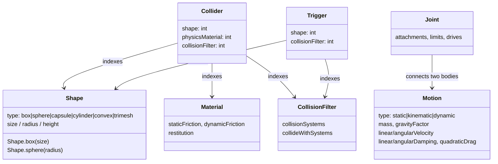
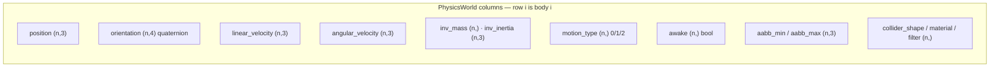
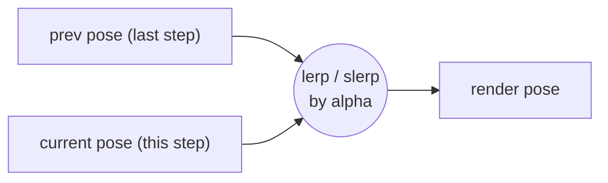
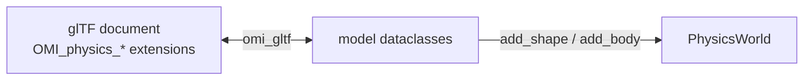

# Data model

`omi_physics` uses two representations of the same physics, for two different
jobs:

1. The **OMI data model** (`model.py`) — immutable dataclasses that mirror the
   [OMI glTF physics](https://github.com/omigroup/gltf-extensions) extensions.
   This is how you *describe* a scene, and how scenes round-trip to and from glTF.
2. The **structure-of-arrays world** (`world.py`) — flat NumPy columns the
   simulation actually mutates each step.

You build with the first; the world consumes it and stores each body's quantities
in the second.

## OMI dataclasses



`Shape`, `Material`, and `CollisionFilter` are **shared, interned resources**:
you add each once to the world (`add_shape`, `add_material`, `add_filter`) and
get back an integer index, then many colliders reference the same index. A
thousand identical crates share one `Shape`.

`Motion.type` decides how a body participates:

| type | integrated? | collides? | moved by contacts? |
| --- | --- | --- | --- |
| `static` | no | yes | no |
| `kinematic` | pose set externally | yes | no (pushes others) |
| `dynamic` | yes | yes | yes |

## The structure-of-arrays world

`PhysicsWorld` stores every per-body quantity as its own contiguous NumPy column,
indexed by a body's integer id. Adding a body appends a row to every column
(arrays grow geometrically); the id is stable for the body's lifetime.



Because each quantity is one array, a stage is a whole-array operation. "Apply
gravity to every awake dynamic body" is:

```python
dyn = world.dynamic_mask()                    # boolean (n,)
world.linear_velocity[dyn] += g * dt          # one vectorized write
```

no per-body Python loop. This is the single most important performance decision
in the engine, and the reason the state maps cleanly onto GPU buffers (see
[ARCHITECTURE.md](ARCHITECTURE.md)).

### Poses for rendering

The world keeps both the current pose and the previous step's pose
(`prev_position`, `prev_orientation`). A renderer running faster than the fixed
timestep calls `writeback(alpha)` (or reads a `ThreadedSimulation` snapshot) to
get poses interpolated between the two, so motion stays smooth between steps:



## glTF round-trip

`omi_gltf.py` reads OMI physics bodies out of a parsed glTF document into `model`
dataclasses, and writes `model` dataclasses back into a document. This is what
makes a scene authored in a glTF tool loadable here, and a simulated scene
exportable:


