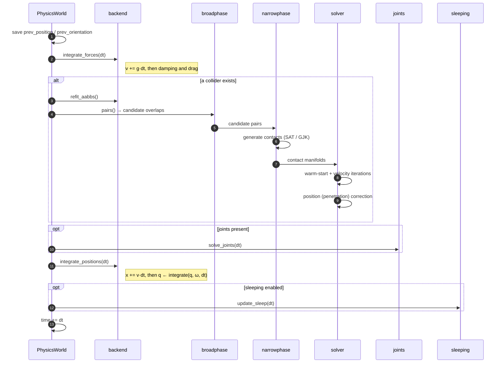

# The step pipeline

`PhysicsWorld.step(dt)` advances the whole world by one **fixed** timestep. A
real-time caller drives it through `advance(real_dt)`, which runs an accumulator
so the simulation always steps in equal `dt` slices regardless of frame rate.

```mermaid
flowchart TB
    subgraph advance["world.advance(real_dt)"]
        acc[accumulate real_dt] --> loop{accumulator ≥ fixed_dt?}
        loop -->|yes| step[step&#40;fixed_dt&#41;]
        step --> loop
        loop -->|no| interp[return interpolation alpha]
    end
```

## One step, stage by stage

## What flows between stages

| Stage | Reads | Writes |
| --- | --- | --- |
| **integrate forces** | `linear/angular_velocity`, `gravity`, damping, drag | `linear/angular_velocity` |
| **refit AABBs** | `position`, `orientation`, shape half-extents | `aabb_min`, `aabb_max` |
| **broadphase** | `aabb_min/max`, collision filters | candidate `(i, j)` pairs |
| **narrowphase** | candidate pairs, `position`, `orientation`, shapes | `Contact` manifolds (normal, points, depth) |
| **solver** | contacts, velocities, inverse mass/inertia, materials | `linear/angular_velocity`, positional correction |
| **joints** | joint definitions, body poses/velocities | velocities, poses |
| **integrate positions** | velocities | `position`, `orientation` |
| **sleeping** | velocities over time | `awake`, `sleep_timer` |

## Broadphase → narrowphase → solve

```mermaid
flowchart LR
    subgraph broad["Broadphase — cheap, approximate"]
        SAP[sort AABBs on an axis<br/>sweep &amp; prune] --> CAND[candidate pairs<br/>&#40;may overlap&#41;]
    end
    subgraph narrow["Narrowphase — exact"]
        CAND --> ROUTE{shape pair}
        ROUTE -->|box·box / sphere| FAST[SAT / analytic<br/>collide.py · _collide_native]
        ROUTE -->|general convex| GJK[GJK / EPA<br/>gjk.py]
        FAST --> MAN[contact manifolds]
        GJK --> MAN
    end
    subgraph solve["Solver — sequential impulse"]
        MAN --> ISL[build islands<br/>connected bodies]
        ISL --> WS[warm start from<br/>last step's impulses]
        WS --> VI[velocity iterations<br/>Gauss–Seidel]
        VI --> PC[position correction]
    end
```

**Broadphase** never claims two bodies *are* touching — only that their AABBs
overlap, so they are worth an exact test. It exists to keep the exact test off the
O(n²) all-pairs cost.

**Narrowphase** turns each surviving pair into a contact manifold: a normal, one
or more contact points, and a penetration depth. Box-box and sphere pairs — the
overwhelming majority in a typical scene — take a vectorized SAT / analytic path
(and the `_collide_native` accelerator when present); general convex shapes go
through GJK/EPA.

**Solver** groups contacting bodies into independent *islands* and solves each
with sequential-impulse Gauss–Seidel: it iterates over the contacts applying
velocity impulses until they stop interpenetrating, warm-starting from the
previous step's impulses so stacks settle quickly. This is the stage the
`_solver_native` accelerator replaces.

## Determinism

On the `NumpyBackend` the pipeline is float64 and every stage visits bodies and
contacts in a stable order, so a scene replays bit-for-bit. Two things break that
deliberately:

- The **GPU backend** (`glcompute.py`) computes integration in float32, so its
  trajectories match the CPU path only within tolerance.
- **Sleeping** is timing-dependent only in the sense of accumulated `dt`; with a
  fixed `dt` it too is deterministic.
